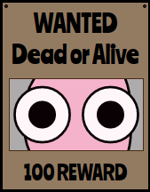

#  Blobs Dead or Alive

A fast-paced "Find the Blob" game built with React, Next.js, and generative art.



## 🎮 How to Play

Try it on the [Web](http://alfredosalzillo.me/blobs-dead-or-alive/).

The goal is simple: find the "Wanted" blob among a crowd of similar-looking blobs before time runs out!

## ✨ Features

- **Generative Art**: Every blob is uniquely generated with different shapes, colors, and features.
- **Rush Mode**: Test your speed in an endless survival mode.
- **Campaign Mode**: Progress through increasingly difficult stages (Coming Soon).
- **Progressive Web App (PWA)**: Install it on your device for an app-like experience.
- **Cross-Platform**: Available on Web and Android (via TWA).

## 🛠️ Tech Stack

- **Framework**: [Next.js 15+](https://nextjs.org/) (App Router)
- **Library**: [React 19](https://react.dev/)
- **Styling**: [SASS](https://sass-lang.com/)
- **Linter/Formatter**: [Biome](https://biomejs.dev/)
- **PWA**: `@ducanh2912/next-pwa`
- **Backend/Analytics**: [Firebase](https://firebase.google.com/)

## 🚀 Getting Started

### Prerequisites

- Node.js 18+
- npm or yarn

### Installation

1. Clone the repository:
   ```bash
   git clone https://github.com/alfredosalzillo/blobs-dead-or-alive.git
   cd blobs-dead-or-alive
   ```

2. Install dependencies:
   ```bash
   npm install
   ```

3. Run the development server:
   ```bash
   npm run dev
   ```

4. Open [http://localhost:3000/blobs-dead-or-alive/](http://localhost:3000/blobs-dead-or-alive/) in your browser.

### Scripts

- `npm run build`: Build the project for production (Static Export).
- `npm run lint`: Run Biome for linting.
- `npm run format`: Format code with Biome.
- `npm run generate:stage`: Generate a new campaign stage (requires `ts-node`).

## 📜 License

This project is licensed under the terms found in the [LICENSE](./LICENSE) file (if available) or is private.

---
Made with ❤️ and blobs.
